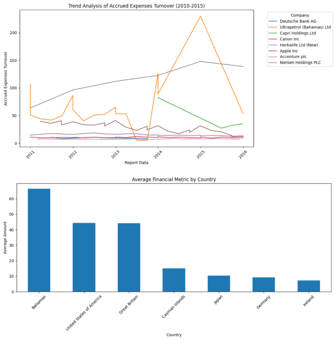

# Nasdaq API Financial Data Analysis

In this brief project, we will highlight the importance of APIs in data analysis. Application Programming Interfaces (APIs) are commonly utilized in analysis to obtain streamlined and up-to-date data, as will be illustrated shortly. In this project, we will be using data from the Nasdaq Data Link API, focusing on the MER/F1 data table. This table contains comprehensive financial data from a set of companies, including balance sheets, cash flow statements, and income statements. Using this information, we will be able to understand their financial performance over time. We will also investigate and analyze how their financial values compare with each other and across different regions.

Our goals for this project are to demonstrate the usefulness of APIs in data analysis, while also using Python, Pandas, and Matplotlib. We will be performing some light analysis, while mainly focusing on the technical skills. These include using APIs, data retrieval, cleaning, and visualizing.

The two main questions we will be answering in this project are:

- How do the Accrued Expenses Turnover amounts from each company change and compare with each other over a certain period?
- How does the average Accrued Expenses Turnover amount from each country differ from that of other regions?

View this project live on Google Colab [here](https://colab.research.google.com/drive/1dF_cw9aWtN3vwq_zsoEcWjAklW2kdM5R?usp=sharing).
